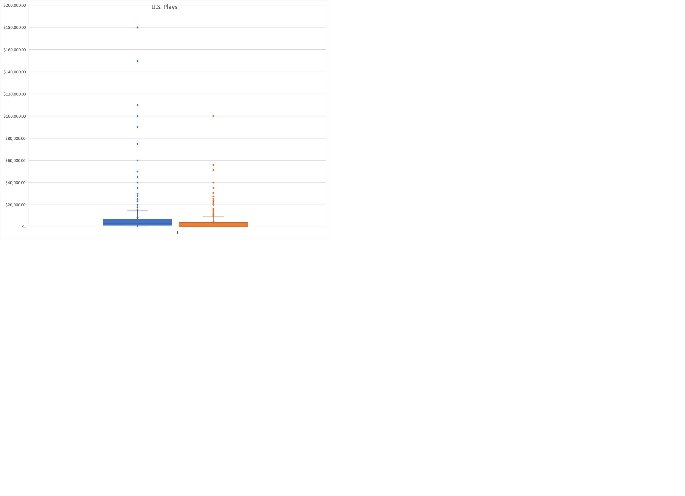

# An Analysis of Kickstarter Campaigns
In this project, the goal was to help Louise with her campaign for a theatrical production. She estimated that her play will cost around $12,000

After doing analysis on the data, we see that theatre productions, specifically plays have a high success rate. 

However, her project cost of around $12,000 puts her above the highest point of the quartiled and would classify her project as an outlier. The chart below is from all US plays.

Some large values are driving all of these distributions. The standard deviations are all roughly twice the IQR in each distribution, except in the failed Kickstarters, where the standard deviation is closer to three times the IQR. There must be some failed Kickstarters with really high goals!
