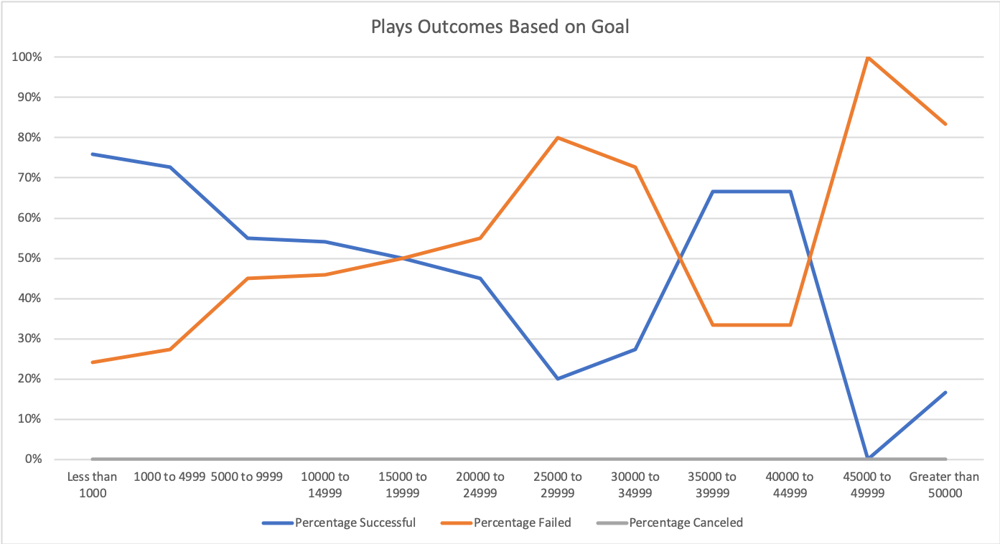

# An Analysis of Kickstarter Campaigns
In this project, the goal was to help Louise with her campaign for a theatrical production. She estimated that her play will cost around $12,000

After doing analysis on the data, we see that theatre productions, specifically plays have a high success rate. 

However, her project cost of around $12,000 puts her right around the highest point of the quartile. The chart below is from all US plays.

The standard deviations are around 2x the IQR in each distribution. In the failed projects it is almost 3x the IQR. Some of the goals must have been extremely large.

There also seems to be a bit of seasonality in the data. May and June have the highest successful campaigns

My reccomendation to Louise is to launch her campaign in either May or June. I would also suggest that she lower her goal to be closer to the median or mean. The category of kickstarter campaign that she wants to create has a high success rate.

### Challenge
For this challenge we looked at a few other factors that may determine the outcomes. We mainly looked at outcome based on launch date, and on the goal amount. 

Here is what we learned when looking at the launch dates of all theater productions:
1. There is an increase of success by launching your campaign in May or June. The mean for the data is 69.9 and the median is 68 for successful campaigns, in May there is an increase of 58.6% from the mean and in June it is 42.9% higher from the mean as well.
2. The canceled and failed campaigns remain more or less in a steady range throughout the year with rise in May and June as well.

However, there are limitations to this data. Louise is looking to launch a theatrical play in the US. The data we are looking at is not as specific as it could be. The pivot table and graph that we created for the challenege was for all regions and all theater parent categories. I would suggest that we limit the scope to just US based projects and filter the subcategory to only include plays. This would give us a more specific and accurate picture of outcomes. Another thing that I would look at is whether the duration of the the campaign has any correlation to the outcome. Do campaigns launched in May or June have a higher success rate due to having longer periods to get to their goal? I think this chart would give us more insight into what is really going on. I would also look at the percentage funded data. Does the launch date have any effect on how funded the projects are? does duration have anything to do with it?

 
 The "background" info that is provided states the following "Louise’s play Fever came close came close to its fundraising goal in a short amount of time. How many other Kickstarter campaigns were able to do this as well? In this challenge, you’ll conduct a data analysis to answer this question and determine whether the length of a campaign contributes to its ultimate success or failure." It seems that we did not analyze the length of the campaign component in this excersice. 
