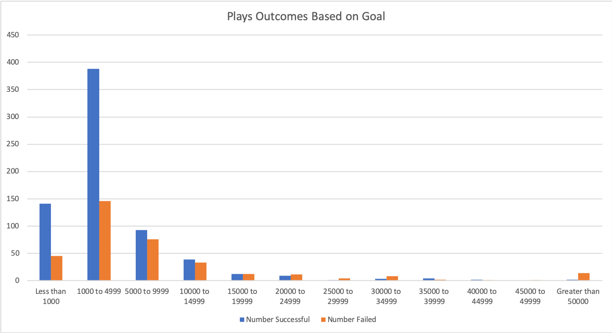

# An Analysis of Kickstarter Campaigns
In this project, the goal was to help Louise with her campaign for a theatrical production. She estimated that her play will cost around $12,000

After doing analysis on the data, we see that theatre productions, specifically plays have a high success rate. 

However, her project cost of around $12,000 puts her right around the highest point of the quartile. The chart below is from all US plays.

The standard deviations are around 2x the IQR in each distribution. In the failed projects it is almost 3x the IQR. Some of the goals must have been extremely large.

There also seems to be a bit of seasonality in the data. May and June have the highest successful campaigns

My recommendation to Louise is to launch her campaign in either May or June. I would also suggest that she lower her goal to be closer to the median or mean. The category of kickstarter campaign that she wants to create has a high success rate.

### Challenge
For this challenge we looked at a few other factors that may determine the outcomes. We mainly looked at outcome based on launch date, and on the goal amount. 

In the first part of this exercise we looked at outcomes based on the goal column.  Here is what we saw:
1. looking at the goal table, we see that a vast majority of the successful campaigns were looking to raise less than $10,000 (89.6%). In fact, 76.2% of the successful campaigns had goals of under $5,000 dollars. Smaller goals had a much higher chance of success in absolute numbers.
2. when looking at the failed projects, we see that 75% of them were asking to raise less than $10,000. Only a small percentage of the total were asking for large amounts.
3. The graph is looking at percentages for success, failed, or cancelled. It shows us that the lower goal amounts have a better chance of success, it also shows us that there is an increased likelihood of success when the goal is between $35,000 and $44,999. 

There was an error in the instructions for this module. I followed the instructions exactly as they were posted. In the goal column the >50k should have been >=50k.  If we follow the instructions then we dont include the values at exactly 50k. This left out 4 of the options and skews the data. When re-doing this chart i would change that goal parameter to include $50k as well.

I think that the graph from the exercise is misleading because it is solely based off of the percentage of success in each goal category. It does not take into account the frequency of each occurence based on goal amount. For example: in the $25,000 to $29,999 category there is an 80% failure rate, but this is only out of 5 projects in the data set. That is 0.47% of all the projects. Another example is in the $45,000 to $49,999 range. There is only one data entry, and you have a failure rate of 100%. The boost that we see above in the $35,000 to $44,999 range is only based off of 9 instances out of 1,047. I think a much better way of looking at the data is to forget about percentages and instead have a stacked bar graph using the actual number of the data sets vs the percentage. I have included a graph below that in my opinion paints a more honest picture. I would also filter for country as well to get a more precise picture. 

Here is what we learned when looking at the launch dates of all theater productions:
1. There is an increase of success by launching your campaign in May or June. The mean for the data is 69.9 and the median is 68 for successful campaigns, in May there is an increase of 58.6% from the mean and in June it is 42.9% higher from the mean as well.
2. The canceled and failed campaigns remain more or less in a steady range throughout the year with rise in May and June as well.

However, there are limitations to this data. Louise is looking to launch a theatrical play in the US. The data we are looking at is not as specific as it could be. The pivot table and graph that we created for the challenge was for all regions and all theater parent categories. I would suggest that we limit the scope to just US based projects and filter the subcategory to only include plays. This would give us a more specific and accurate picture of outcomes. Another thing that I would look at is whether the duration of the the campaign has any correlation to the outcome. Do campaigns launched in May or June have a higher success rate due to having longer periods to get to their goal? I think this chart would give us more insight into what is really going on. I would also look at the percentage funded data. Does the launch date have any effect on how funded the projects are? does duration have anything to do with it? One thing missing from this chart is the "live" outcome. This was filtered out to match the instructions in the module. There may be a benefit to looking at this as well.

The "background" info that is provided states the following "Louise’s play Fever came close came close to its fundraising goal in a short amount of time. How many other Kickstarter campaigns were able to do this as well? In this challenge, you’ll conduct a data analysis to answer this question and determine whether the length of a campaign contributes to its ultimate success or failure." It seems that we did not analyze the length of the campaign component in this excercise. I think it would have been good to calculate the length of the campaigns and comparing them to the outcomes.
